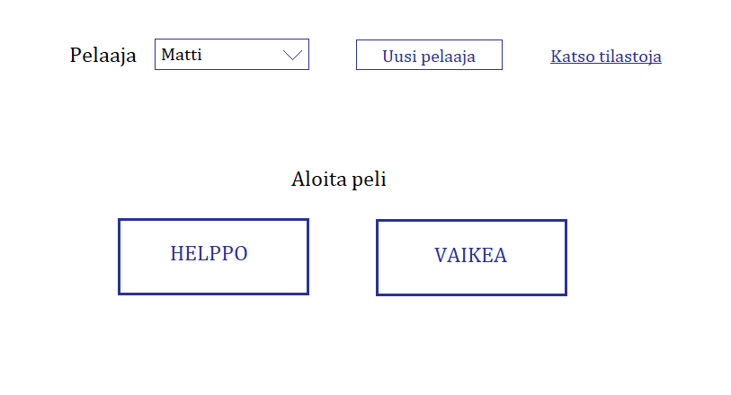
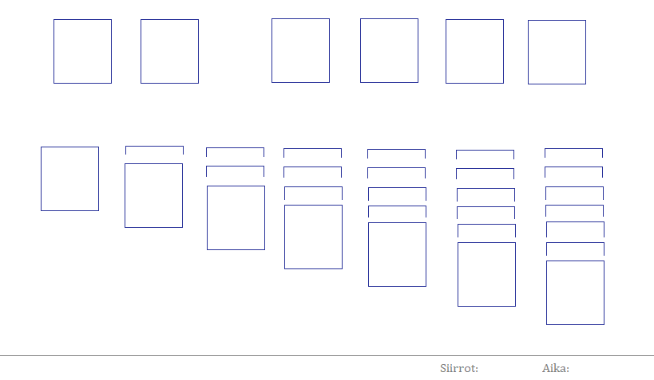

# Vaatimusmäärittely

## Sovelluksen tarkoitus

Pasianssin (Klondike) pelaaminen. Eri vaikeustasoja. Sovellus tallettaa tietoa pelatuista peleistä, mikä mahdollistaa omien pelitulosten parantamisen ja vertailun muiden tuloksiin.

## Käyttäjät

Yksi käyttäjärooli eli pelaaja. Pelaaja voi käyttää aiemmin luotua nimimerkkiä tai luoda uuden. Tiedot peleistä tallentuvat nimimerkin mukaan.

## Käyttöliittymäluonnos

Aloitusnäkymä

Pelinäkymä

## Toiminnallisuus

Käyttäjä voi valita helpon tai vaikean pelin. Helpossa kortteja käännetään yksi kerrallaan, vaikeassa kolme kerrallaan. Pelaaja siirtää kortteja pakasta toiseen raahaamalla. Kortti on mahdollista siirtää ns. peruspakkaan myös tuplaklikkaamalla. Pelin aikana näytöllä näkyy tehtyjen siirtojen määrä ja kulunut aika. Nämä tiedot tallentuvat kun peli menee läpi tai kun pelaaja lopettaa pelin (sulkemalla sovelluksen tai aloittamalla uuden pelin).

## Jatkokehitysideoita

Mahdollisuus pelata muitakin pasiansseja, esim. Spider.
