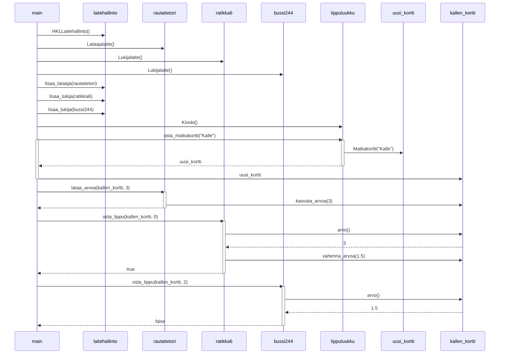

## HSL

```mermaid
sequenceDiagram
    main->>laitehallinto: HKLLaitehallinto()

    %% 
    main->>rautatietori: Lataajalaite()
    main->>ratikka6: Lukijalaite()
    main->>bussi244: Lukijalaite()

    %%
    main->>laitehallinto: lisaa_lataaja(rautatietori)
    main->>laitehallinto: lisaa_lukija(ratikka6)
    main->>laitehallinto: lisaa_lukija(bussi244)

    %%
    main->>lippuluukku: Kioski()

    %%
    main->>lippuluukku: osta_matkakortti("Kalle")
    activate main

    activate lippuluukku
    lippuluukku->>uusi_kortti: Matkakortti("Kalle")
    lippuluukku-->>main: uusi_kortti
    deactivate lippuluukku

    main->>kallen_kortti: uusi_kortti
    deactivate main

    %%
    main->>rautatietori: lataa_arvoa(kallen_kortti, 3)
    activate rautatietori
    rautatietori->>kallen_kortti: kasvata_arvoa(3)
    rautatietori-->>main: 
    deactivate rautatietori

    %%
    main->>ratikka6: osta_lippu(kallen_kortti, 0)
    activate ratikka6
    ratikka6->>kallen_kortti: arvo()
    kallen_kortti-->>ratikka6: 3
    ratikka6->>kallen_kortti: vahenna_arvoa(1.5)
    ratikka6-->>main: true 
    deactivate ratikka6

    main->>bussi244: osta_lippu(kallen_kortti, 2)
    activate bussi244
    bussi244->>kallen_kortti: arvo()
    kallen_kortti-->>bussi244: 1.5
    bussi244-->>main: false 
    deactivate bussi244

```