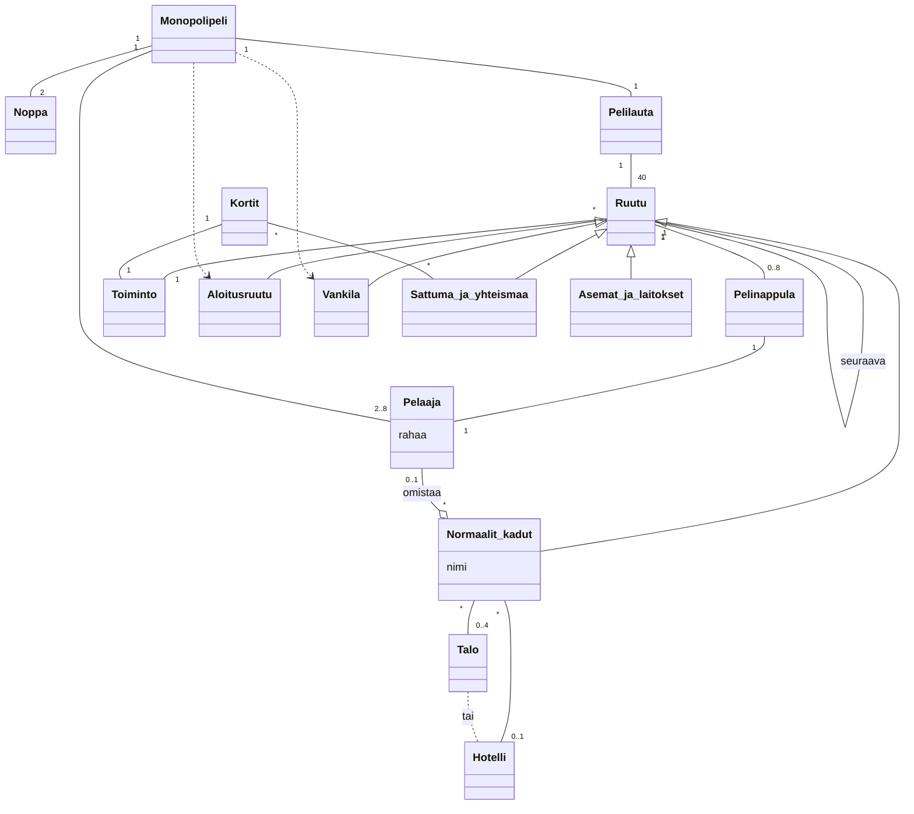

## Monopoli

```mermaid
 classDiagram
    Monopolipeli "1" -- "2" Noppa
    Monopolipeli "1" -- "1" Pelilauta
    Pelilauta "1" -- "40" Ruutu
    Ruutu "1" -- "1" Ruutu : seuraava
    Ruutu "1" -- "0..8" Pelinappula
    Pelinappula "1" -- "1" Pelaaja
    Pelaaja "2..8" -- "1" Monopolipeli
    Ruutu "*" -- "1" Toiminto
    Ruutu <|-- Aloitusruutu
    Ruutu <|-- Vankila
    Ruutu <|-- Sattuma_ja_yhteismaa
    Ruutu <|-- Asemat_ja_laitokset
    Ruutu <|-- Normaalit_kadut
    Kortit "*" -- "*" Sattuma_ja_yhteismaa
    Kortit "1" -- "1" Toiminto
    Monopolipeli ..> Aloitusruutu
    Monopolipeli ..> Vankila
    Pelaaja "0..1" --o "*" Normaalit_kadut : omistaa
    Normaalit_kadut "*" -- "0..4" Talo
    Normaalit_kadut "*" -- "0..1" Hotelli
    Talo .. Hotelli : tai
    class Normaalit_kadut{
        nimi
    }
    class Pelaaja {
        rahaa
    }
```
