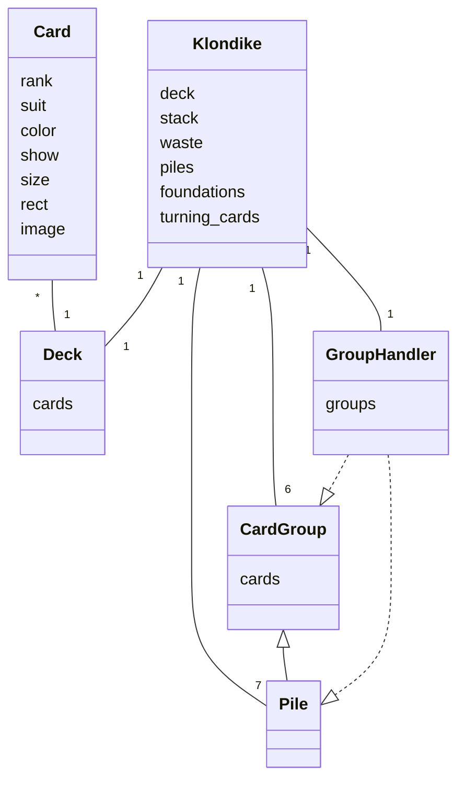
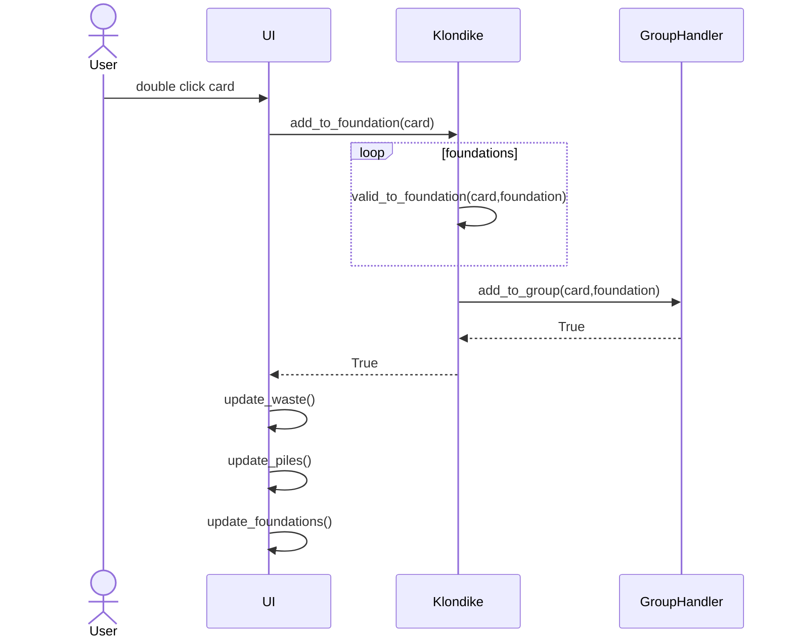

## Sovelluslogiikka

## Toiminnallisuudet

### Kortin siirto peruspakkaan tuplaklikkaamalla

Kun käyttäjä tuplaklikkaa korttia, joka on kelvollinen siirrettäväksi johonkin neljästä peruspakasta, etenee sovelluksen kontrolli seuraavasti:

