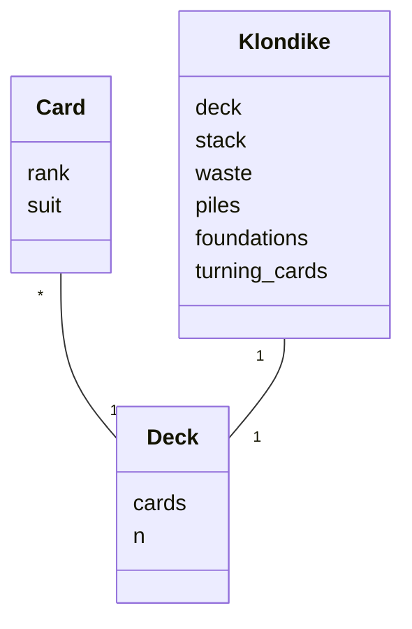

## Sovelluslogiikka

```mermaid
 classDiagram
    Card "*" -- "1" Deck
    Klondike "1" -- "1" Deck
   class Card{
        rank
        suit
    }
    class Deck{
        cards
        n
    }
    class Klondike{
        deck
        stack
        waste
        piles
        foundations
        turning_cards
    }
```
