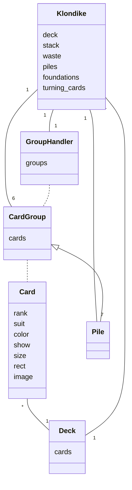
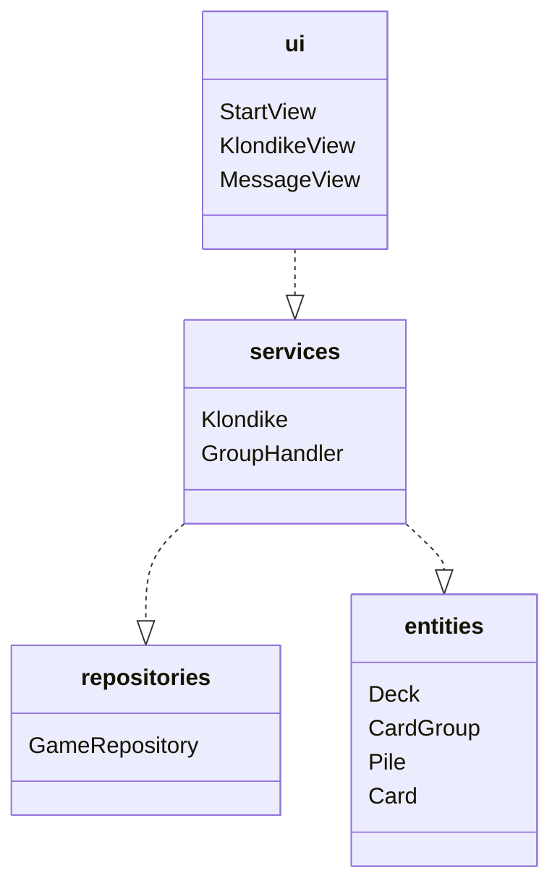
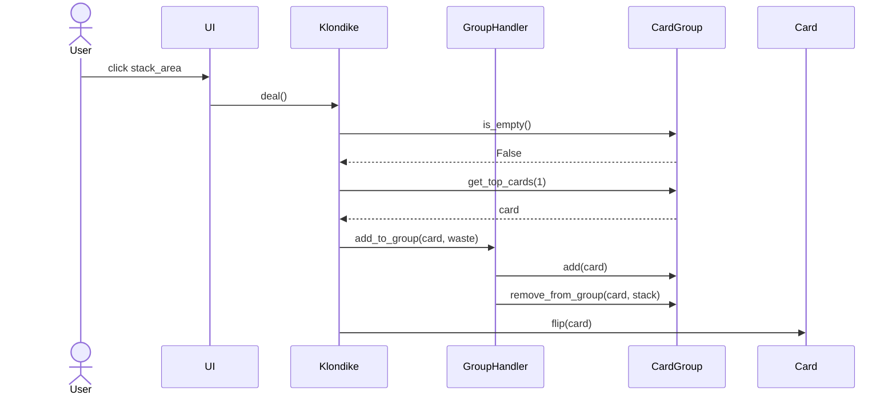
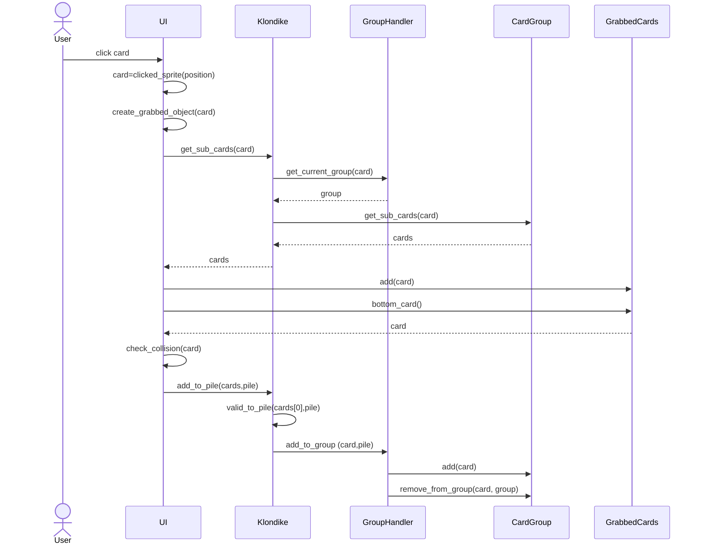
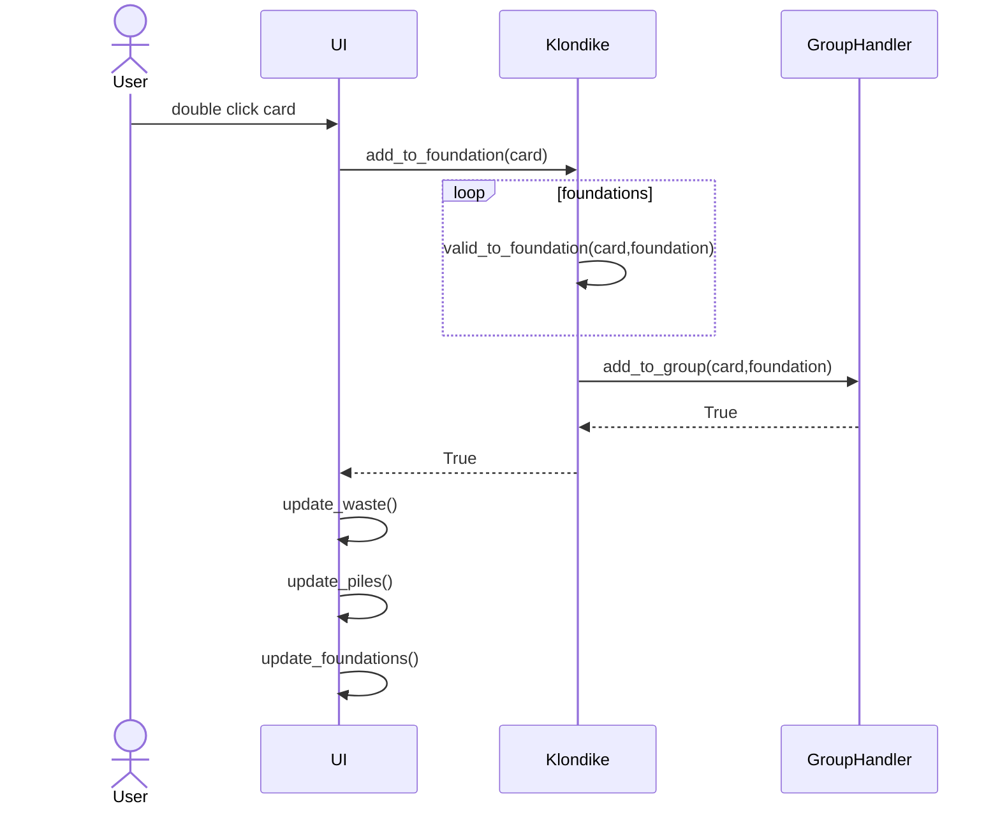

# Arkkitehtuurikuvaus

## Rakenne

Ohjelman rakenne noudattaa kolmitasoista kerrosarkkitehtuuria, ja koodin rakenne on seuraava:

Pakkaus ui sisältää käyttöliittymästä, services sovelluslogiikasta ja repositories tietojen pysyväistallennuksesta vastaavan koodin. Pakkaus entities sisältää luokkia, jotka kuvastavat sovelluksen käyttämiä tietokohteita.

## Käyttöliittymä

Käyttöliittymä sisältää kolme erilaista näkymää:

    Aloitusnäkymä
    Pelinäkymä
	Viestinäkymä
	
Näkymien näyttämisestä vastaa UI-luokka siten että yksi näytöistä on kerrallaan näkyvissä. Näkymät on toteutettu omina luokkinaan. Aloitusnäkymässä voi antaa nimimerkin ja valita pelin vaikeustason. Pelinäkymässä pelataan itse peliä. Viestinäkymä tulee näkyviin, kun peli menee läpi tai kun pelaaja haluaa lopettaa pelin. Tällöin pelaaja voi valita, haluaako palata aloitusnäkymään vai jatkaa pelaamista.

## Sovelluslogiikka

Sovelluksen loogisen tietomallin muodostavat luokat:

-Klondike: Pelin logiikasta vastaava luokka.

-GroupHandler: Luokka, joka vastaa korttien siirrosta ryhmästä toiseen.

-CardGroup: Korttiryhmästä vastaava luokka.

-Pile: Pinosta vastaava luokka. Perii luokan CardGroup. 

-Deck: Korttipakasta vastaava luokka. 

-Card: Yksittäisesta kortista vastaava luokka.

Hakemistorakennetta kuvaava pakkauskaavio

## Tietojen pysyväistallennus

Pakkauksen repositories-luokka GameRepository huolehtii tietojen tallettamisesta SQLite-tietokantaan.

## Päätoiminnallisuudet

### Kortin/korttien kääntö käsipakasta
Kun käyttäjä klikkaa käsipakkaa, jossa on kortteja jäljellä, etenee sovelluksen kontrolli seuraavasti:

### Kortin/korttien siirto pinosta toiseen
Kun käyttäjä siirtää yhden tai useamman kortin pinosta toiseen, etenee sovelluksen kontrolli seuraavasti:

### Kortin siirto peruspakkaan tuplaklikkaamalla

Kun käyttäjä tuplaklikkaa korttia, joka on kelvollinen siirrettäväksi johonkin neljästä peruspakasta, etenee sovelluksen kontrolli seuraavasti:

