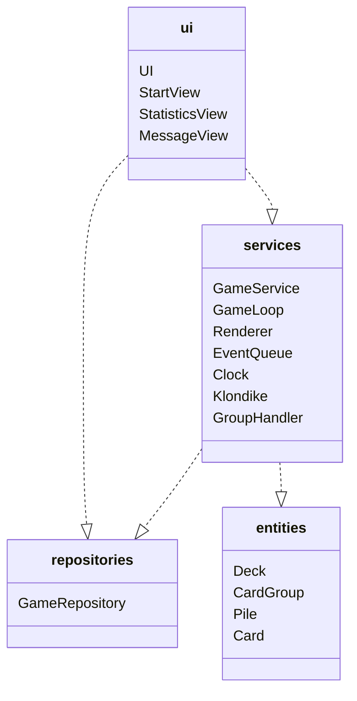
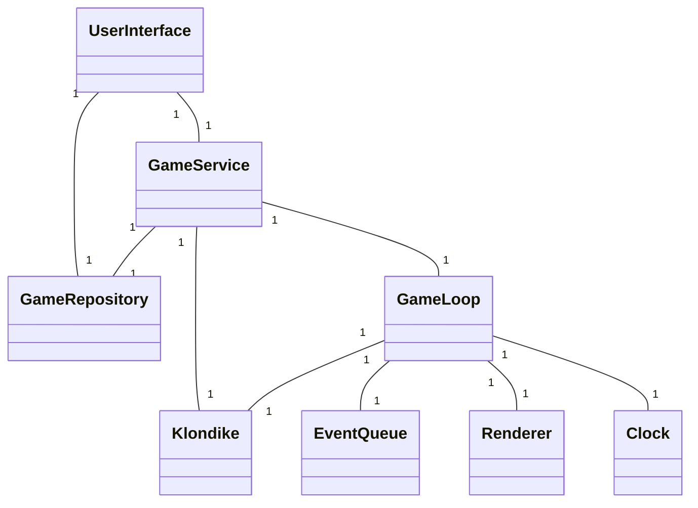
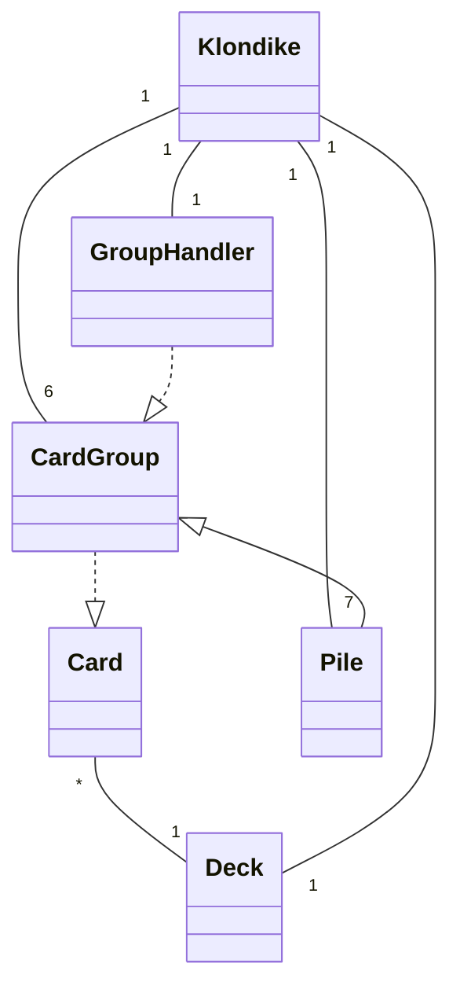
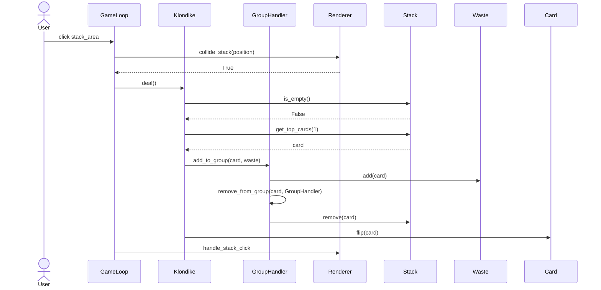
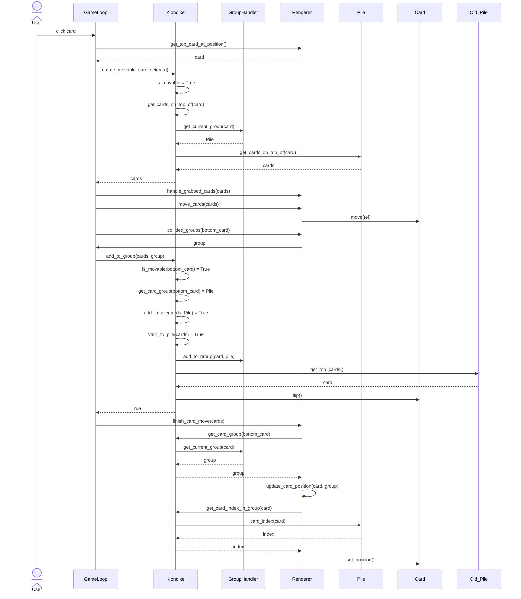

# Arkkitehtuurikuvaus

## Rakenne

Ohjelman rakenne noudattaa kolmitasoista kerrosarkkitehtuuria, ja koodin rakenne on seuraava:

Pakkaus _ui_ sisältää käyttöliittymään liittyvän koodin. Pakkaus _services_ sisältää pelin sovelluslogiikan ja pelisilmukan sekä luokkia, joita pelisilmukka ja sovelluslogiikasta vastaava luokka hyödyntävät. (Vaikka luokka `Renderer` liittyy oleellisesti käyttöliittymään, on se sijoitettu palveluiden alle, koska `GameLoop`-luokka käyttää sitä.) Pakkaus _repositories_ vastaa tietojen pysyväistallennuksesta. _Entities_ sisältää luokkia, jotka kuvastavat sovelluksen käyttämiä tietokohteita.

## Käyttöliittymä

Käyttöliittymä sisältää neljä erilaista näkymää:

- Aloitusnäkymä
- Tilastonäkymä
- Viestinäkymä
- Pelinäkymä
	
Näkymät on toteutettu omina luokkinaan. Yksi näkymistä on kerrallaan näkyvissä. UI-luokka vastaa aloitusnäkymän ja viestinäkymän näyttämisestä. Viestinäkymään siirrytään, kun peli päättyy tai kun pelaaja haluaa lopettaa pelin, ja sen tarkoitus on varmistaa käyttäjän tekemät valinnat. Tilastonäkymään siirrytään suoraan aloitusnäkymästä, ja se hakee pelien tiedot repository-luokkaa käyttäen. Pelisilmukka vastaa pelinäkymän näyttämisestä sille injektoidun näytön piirtäjän kautta. 

Käyttöliittymä on eristetty sovelluslogiikasta ja niin ikään käyttöliittymän ulkoasun asetukset on eriytetty näkymistä. Ne on määritelty erillisessä tiedossa. Pelinäkymän pelikohtaiset ulkoasuasetukset injektoidaan näytön piirtämisestä vastaavalle luokalle konstruktorikutsun yhteydessä. 

## Sovelluslogiikka

Ohjelman päätason luokkarakenne on seuraavanlainen:

Pelin käynnistämiseksi UI-olio luo `GameService`-luokan olion ja kutsuu sen play-metodia. `GameService`-luokalle injektoidaan pelin (`Klondike`), tallentajan (`GameRepository`) ja pelisilmukan (`GameLoop`) toteutus konstruktorikutsun yhteydessä. `GameLoop`-luokalle puolestaan injektoidaan pelin (`Klondike`), tapahtumajonon (`EventQueue`), näytön piirtäjän (`Renderer`) ja kellon (`Clock`) toteutus konstruktorikutsun yhteydessä.

Klondike-pelin loogisen tietomallin muodostavat seuraavat luokat:

- `Klondike`: Pelin logiikasta vastaava luokka.
- `GroupHandler`: Luokka, joka vastaa korttien siirrosta ryhmästä toiseen ja joka tietää kunkin kortin ryhmän. Voi myös tyhjentää tuntemansa korttiryhmät.
- `CardGroup`: Korttiryhmästä vastaava luokka. Näitä ovat käsipakka, käsipakan kääntöpakka ja peruspakat sekä käyttöliittymässä siirrettävänä olevat kortit.
- `Pile`: Pinosta (7 kpl) vastaava luokka. Perii luokan CardGroup. 
- `Deck`: Korttipakasta vastaava luokka. 
- `Card`: Yksittäisestä kortista vastaava luokka.

## Tietojen pysyväistallennus

Pakkauksen _repositories_-luokka `GameRepository` huolehtii pelattujen pelien tietojen tallentamisesta SQLite-tietokantaan. Pelattua peliä talletettaessa tarkistetaan löytyykö kyseinen peli ja taso tietokannasta, ja jos ei löydy, niin molemmille luodaan uudet tietueet erillisiin tauluihin. GameRepository myös palauttaa tietoja pelatuista peleistä käytetyn ajan ja siirtojen mukaan järjestettynä. Tallennustapa on mahdollista korvata uudella toteutuksella, jos talletustapaa päätetään vaihtaa.

## Päätoiminnallisuudet

Alla on kuvattu pelin toimintalogiikkaa parin päätoiminnallisuuden osalta sekvenssikaaviona. Toiminnallisuuksissa toistuu sama periaate: pelisilmukasta vastaava `GameLoop`-olio saa tiedon pelaajan toiminnasta `EventQueue`-oliolta ja selvittää toiminnan kohteen `Renderer`-oliolta. Tämän jälkeen se kutsuu pelin logiikasta vastaavan olion metodeja ja kontrollin palatessa `GameLoop`-oliolle `Renderer`-oliolle tehtävillä metodikutsuilla saadaan aikaan tarvittavat muutokset näkymään.

### Kortin/korttien kääntö käsipakasta
Kun käyttäjä klikkaa käsipakkaa, jossa on kortteja jäljellä, etenee sovelluksen kontrolli seuraavasti:

### Kortin/korttien siirto pinosta toiseen
Kun käyttäjä siirtää pinosta kaikki näkyvät kortit toiseen pinoon, etenee sovelluksen kontrolli seuraavasti:

## Muita huomioita

Sovelluksen suunnittelussa on pyritty huomioimaan jatkokehityksen mahdollisuus erityisesti muiden pasianssipelien lisäämiseksi sovelluksen valikoimaan. Pelisilmukan ja näytön piirtäjän toiminta on tehty mahdollisimman geneerisiksi. Pelisilmukka tunnistaa pasianssi-pelin eri versioille yhteiset tapahtumat, ja jättää yksityiskohtaiset toimenpiteet sille injektoidun peli-olion vastuulle. Renderer-luokan toiminta on niin ikään lähes kokonaan riippumaton pelin yksityiskohdista, koska sille injektoidaan pelikohtaiset asetukset, kuten korttien sijainti eikä sillä ole tietoa muun muassa pinojen tai korttien määrästä. Pienellä jatkokehityksellä näytön piirtäjä toimisi esimerkiksi Spider-pasianssin pelaamiseen.

## Ohjelman rakenteeseen jääneet heikkoudet

### Käyttöliittymä
Siirtyminen näkymästä toiseen on toteutettu pitkälti näkymien UI-luokalle palauttamien arvojen perusteella. Lisäksi siirtyminen tilastonäkymään tapahtuu aloitusnäkymästä eikä UI-pääluokalla ole siitä tietoa. Tällainen toteutus ei ole kovin dynaaminen ja asettaa rajoituksia käyttöliittymän jatkokehitykselle. Toisaalta käyttöliittymän pääluokka ei ole nykyisellään kovinkaan _raskas_, joten sen refaktorointi ei vaatisi suurta työtä.
