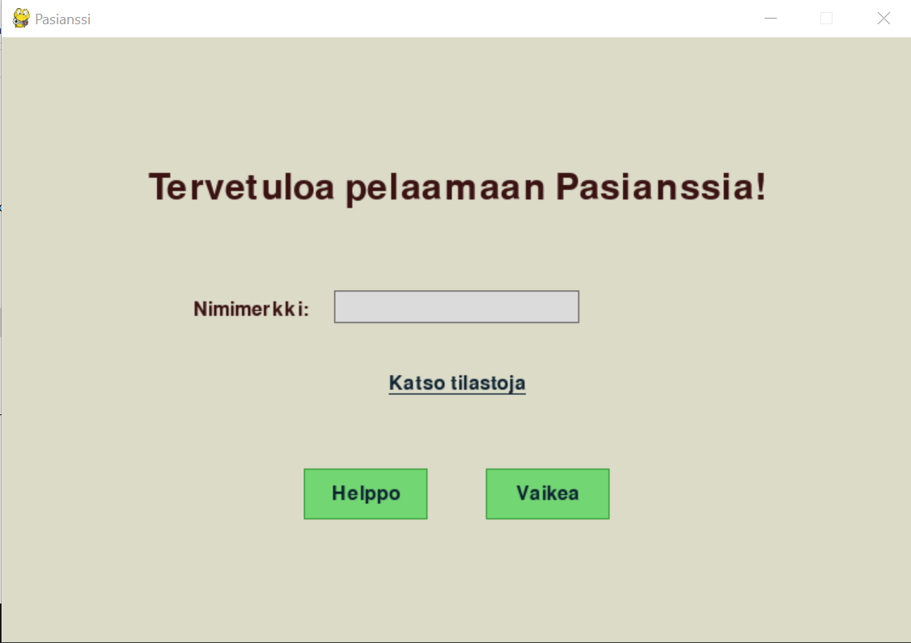
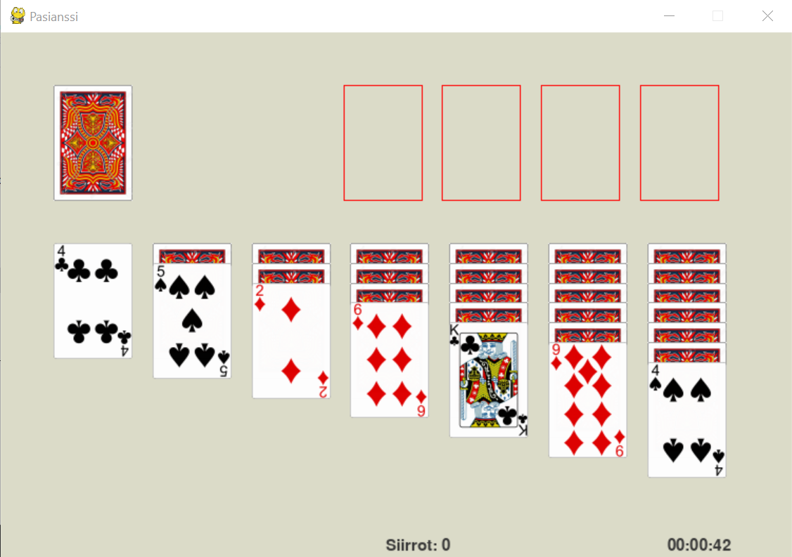
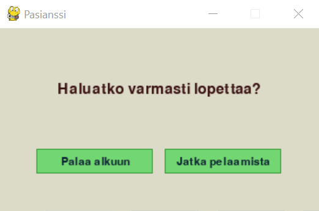

# Käyttöohje

Lataa projektin viimeisimmän [releasen](https://github.com/pankalai/ot-harjoitustyo/releases/) lähdekoodi valitsemalla _Assets_-osion alta _Source code_.


## Ohjelman käynnistäminen

Riippuvuudet asennetaan komennolla:

```bash
poetry install
```

Alustustoimenpiteet suoritetaan komennolla
```bash
poetry run invoke build
```

Ohjelma käynnistyy komennolla:

```
poetry run invoke start
```

## Nimimerkin antaminen ja vaikeustason valinta

Sovellus avautuu näkymään, jossa voi antaa nimimerkin ja valita joko helpon tai vaikean tason. Tilastoja parhaiten pelatuista peleistä voi katsoa klikkaamalla "Katso tilastoja".




## Pelaaminen

Pelin  tarkoituksena on järjestää kortit maittain suuruusjärjestykseen neljään peruspakkaan, jotka ovat pelin alussa tyhjiä. Vasemman reunan käsipakasta voi kääntää kortteja klikkaamalla pakan kuvaa. Kääntyvien korttien määrä riippuu pelin vaikeustasosta. Ainoastaan päällimmäisen kortin voi siirtää joko johonkin pinoon tai suoraan peruspakkaan. Kortteja voi siirtää myös pinosta toiseen tai peruspakasta takaisin pinoon. Kortin voi siirtää peruspakkaan tuplaklikkaamalla. Peli päättyy, kun kaikki kortit ovat peruspakoissa.



## Pelin lopettaminen

Pelin voi lopettaa painamalla oikean yläkulman ruksia ja valitsemalla "Palaa alkuun". 



## Ohjelman sulkeminen

Ohjelmasta poistutaan painamalla aloitusnäkymässä oikean yläkulman ruksia.