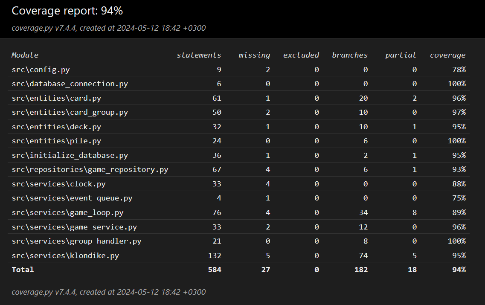

# Testausdokumentti

Ohjelmaa on testattu sekä automatisoiduin yksikkö- ja integraatiotestein unittestilla sekä manuaalisesti tapahtunein järjestelmätason testein.

## Yksikkö- ja integraatiotestaus

### Sovelluslogiikka

Pelisilmukasta vastaavaa `GameLoop`-luokkaa testataan [TestGameLoop](https://github.com/ohjelmistotekniikka-hy/python-todo-app/blob/master/src/tests/services/game_loop_test.py)-testiluokalla. `GameLoop`-olio alustetaan niin, että sille injektoidaan riippuvuuksiksi game-, renderer-, eventqueue- ja clock-luokat. Tätä varten testissä on käytössä luokat `StubGame`, `StubRenderer`,`StubEventQueue` ja `StubClock`. Testeissä on käytetty hyväksi myös Mock-luokkaa varmistamaan, että oikeita metodeja kutsutaan oikeilla parametreilla. Mock-olio on toteutettu `StubGame`- ja `StubRenderer`-olioille.

Klondike-pelistä vastaavaa `Klondike`-luokkaa testataan [TestKlondike](https://github.com/ohjelmistotekniikka-hy/python-todo-app/blob/master/src/tests/services/klondike_test.py)-testiluokalla.

### Repositorio-luokka

Repositorio-luokkaa `GameRepository` testataan testeissä käytössäolevalla tietokannalla. Testitietokannan nimi on konfiguroitu _.env.test_-tiedostoon. `GameRepository`-luokkaa testataan [TestGameRepository](https://github.com/ohjelmistotekniikka-hy/python-todo-app/blob/master/src/tests/repositories/game_repository_test.py)-testiluokalla.

### Testauskattavuus

Käyttöliittymäkerrosta lukuunottamatta sovelluksen testauksen haarautumakattavuus on 94%

Testikattavuuden ulkopuolelle on jätetty paketin ui alla olevat tiedostot ja pelinäkymän piirtämisestä vastaava renderer-luokka. Myöskään _index.py_ ja _build.py_-tiedostoja ei ole testattu.

## Järjestelmätestaus

Sovelluksen järjestelmätestaus on suoritettu manuaalisesti.

### Asennus ja konfigurointi

Sovellus on haettu ja sitä on testattu [käyttöohjeen](./kayttoohje.md) kuvaamalla tavalla sekä Windows- että Linux-ympäristössä. 

### Toiminnallisuudet

Kaikki [määrittelydokumentin](./vaatimusmaarittely.md#perusversion-tarjoama-toiminnallisuus) ja käyttöohjeen listaamat toiminnallisuudet on käyty läpi. 

## Sovellukseen jääneet laatuongelmat

Sovellus ei anna tällä hetkellä järkeviä virheilmoituksia, seuraavissa tilanteissa:

- Konfiguraation määrittelemiin tiedostoihin ei ole luku/kirjoitusoikeuksia
- SQLite tietokantaa ei ole alustettu, eli `python -m poetry run invoke build`-komentoa ei ole suoritettu
